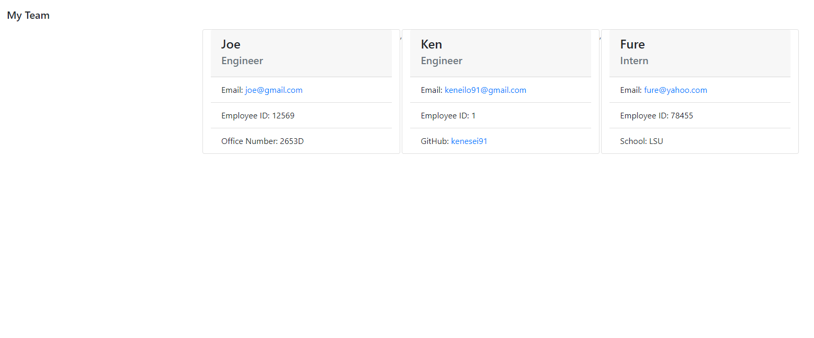

# team-profile-generator

**Node Javascript Challenge

**Version 1.10.0**

**Professional team-profile generator challenge activity.**

The aim of this project is to create an application that takes in information about employees on a software engineering team and generates an HTML webpage that displays summaries for each person withouth the use of browser javascript.

This project focuses on the use of command line to generate a readme file for the user.

Other than creating a readme file, this project required the use of certain prompts to guide the user when creating a file. Using these prompts also ensured that the user selects the appropriate answers that would be featured in the app.

## Built With

- Node.js
- Javascript

## Work Completed

**A successful completion of this project includes the following:**

- [x]Use of series of inquirer prompts
- [x]Use of loops and if, else, and when statements.
- [x]Application of arrays
- [x]Utilizing file system and inquirer packages
- [x]Creating multiple variables and functions
- [x]Use of promises

## Project Visual

- Showing the originial state of the app

## Github pages and links

This project has been deployed to GitHub Pages. 

- [Github Repository](https://github.com/kenesei91/team-profile-generator){:target="_blank" "rel="moopener"}

## Contributors

- Kenechukwu K Ilochonwu <keneilo91@yahoo.com>

## Licence & Copyright

© Kenechukwu K Ilochonwu, Web Project Design

Licensed under the [LICENSE] (MIT LICENSE)
